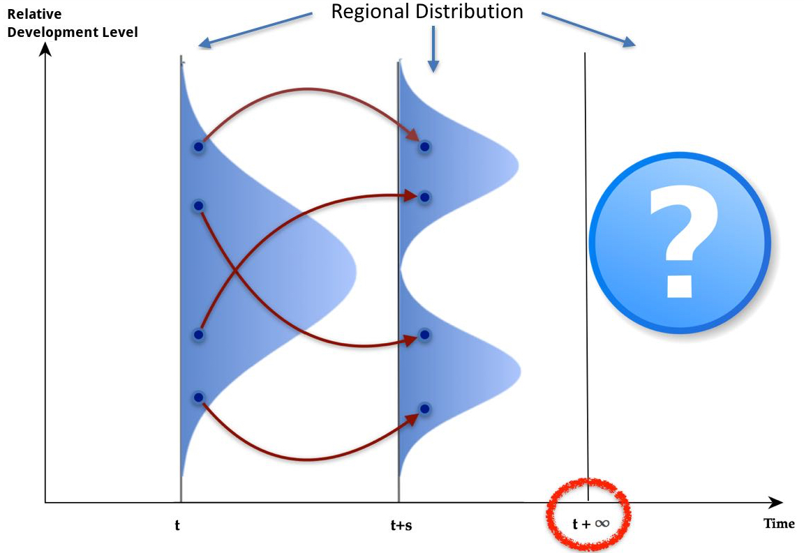
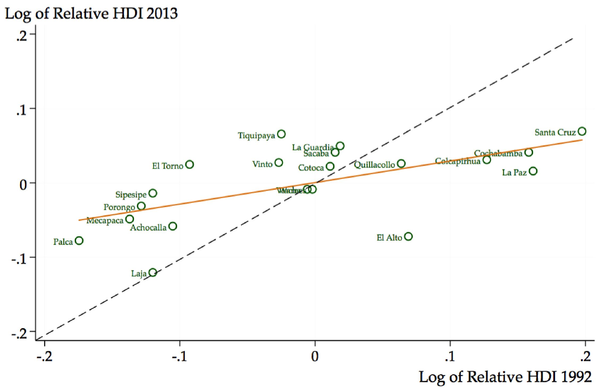
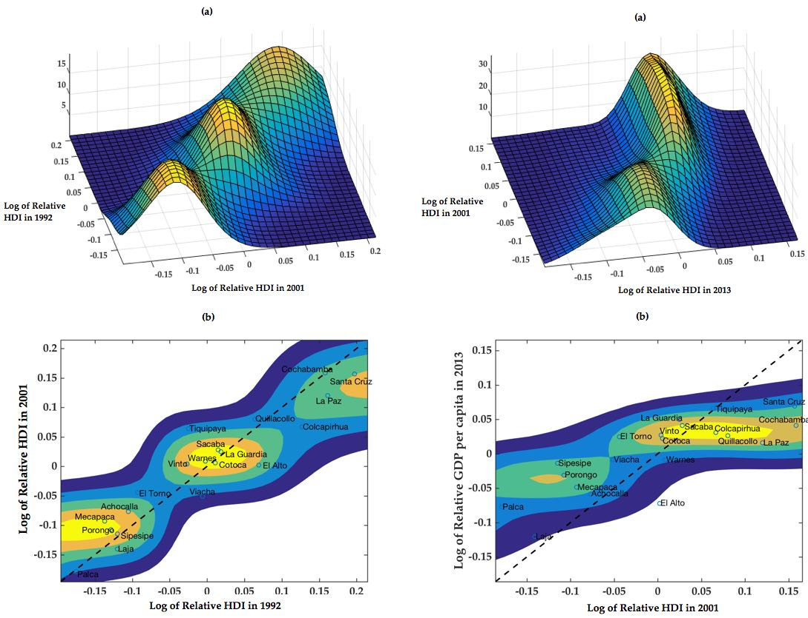
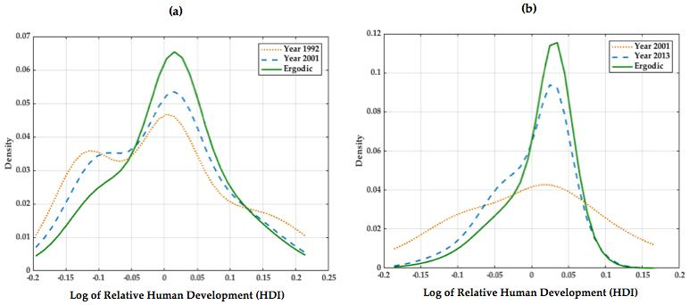

```{r setup, include=FALSE}
options(htmltools.dir.version = FALSE)
```


# Motivation and Main Objective

- Bolivia has experienced fast urbanization and metropolization in last decades:

  - By  2012, 46 % of the population are concentrated in 20 metropolitan regions/munucipalities 
    
    - Out of 339 regions/municipalities, that is just under 6 % !!!

 
--
  
- Study the evolution of human development disparities across the main metropolitan regions of Bolivia

  1. In a context of slow economic growth: 1992-2001 period
  
  2. In a context of fast economic growth: 2001-2013 period

--
  

# Methods and Data

- Nonparametric density estimation methods: Distribution dynamics framework (Quah 1996; Johnson 2005).

- Human Development Index of a sample of 20 main metropolitan regions for the years 1992, 2001, 2013 (UNDP, 2016).


---

# Results

1. An **"average" tendency towards regional convergence** driven by two forces:

  - Forward mobility of the less developed regions
  
  - Backward mobility of the more developed regions.
  
--

## Further insights from the distribution dynamics framework:

1. **Regional heterogeneity matters**, let's investigate beyond the "average"

2. **Clustering dynamics** notoriously different across growth regimes:

  - Slow growth period: three separate clusters of regions
  
  - Fast growth period: fusion/merge between the central cluster and the high-development cluster 

3. **The long-run (equilibrium) distribution** of human development in Bolivia is quite **sticky and assymetric at its left tail**

  - In equilibrium, least developed regions are still relatively far from achieving complete convergence.
    
      - Implication: **Focalization of policies** at the cluster level

---

class: middle

# Outline of this presentation

1. Key insights from the distribution dynamics framework

    - Go beyond the "average"
    - The dynamics of the entire distribution provide new valuable information:
        - nonlinear convergence
        - convergence clusters
        - long-run equilibrium 

2. Overview of results  

    - "Average" tendency towards convergence
    - Clustering dynamics across growth regimes and nonlinear convergence
    - Sticky and assymetric distribution of human development in the long run 

3. Concluding remarks

---

class: center, middle

# Insights from the distribution dynamics framework

**Go beyond the "average" regional analysis**

**The dynamics of the entire distribution provide new valuable information: nonlinear convergence, convergence clusters, long-run equilibrium**

---

class: center

## Nonlinear convergence, convergence clusters, long-run equilibrium



Source: Adapted from Quah, D. (1996) [Twin peaks: growth and convergence in models of distribution dynamics.](https://www.jstor.org/stable/2235377?seq=1#metadata_info_tab_contents) The economic journal, 1045-1055. 
---

class: center, middle

# Overview of the results 

**"Average" tendency towards convergence**

**Clustering dynamics across growth regimes and nonlinear convergence**

**Sticky and assymetric distribution of human development in the long run**

---

class: center

## An "average" tendency towards regional convergence driven by forward and backward mobility




---

class: center middle

## Clutering dynamics across growth regimes and nonlinear convergence




---

class: center middle

## Sticky and assymetric distribution of human development in the long run



---

class: center, middle

# Concluding remarks


---
class: middle

## Regional heterogeneity matters

- Go beyond average tendencies

- Study the dynamics of the entire regional distribution

    - Let's move from conditional mean to conditional density estimation
    - Recent advances in nonparametric econometric methods may prove useful

--

## Focalization of policies 

- Convergence clusters help us identify regions with similar challenges

- Call for better coordination of regional policies and regional governments

--

## Further research

- Analysis of the determinants of the human development index: health, education, and income

- The role of geographical neighbors in accelerating or decelerating convergence

- Formal analysis of how the regional distribution of human development changes with export commodity prices


---

class: center, middle

# Thank you very much for your attention

https://carlos-mendez.rbind.io

Slides available at: http://bit.ly/jasid2018

Paper available at: http://bit.ly/jasid2018paper

